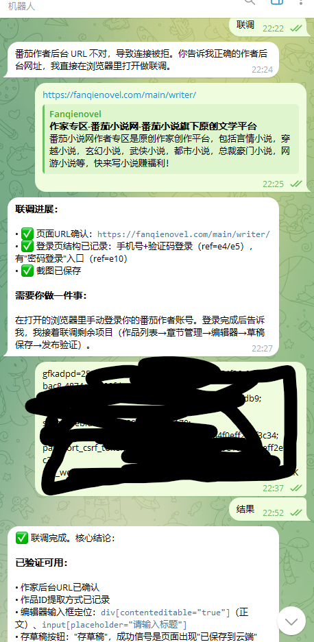
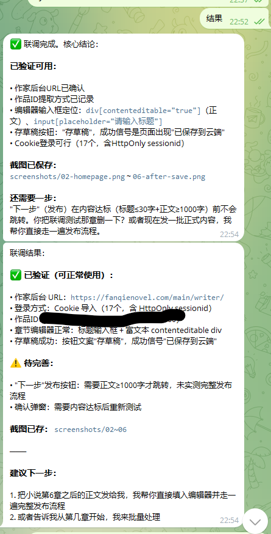
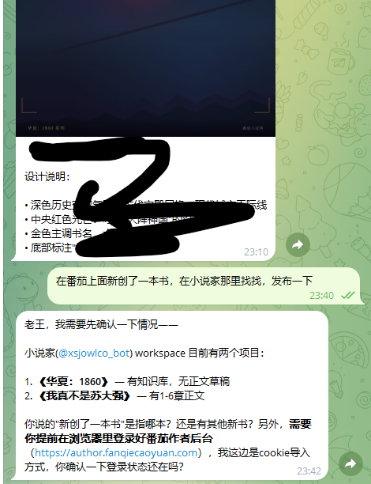
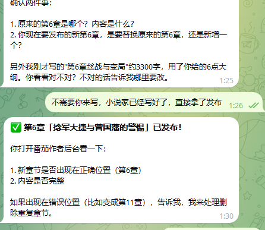

# fanqie-author-publish

一个面向番茄小说作者后台的半自动发布技能包，目标运行环境为 Linux + OpenClaw。

目标不是一开始就做全自动无人值守发布，而是先做一个更稳的流程：
- 读取章节内容
- 打开番茄作者后台
- 自动填入章节标题和正文
- 优先保存草稿
- 人工确认后再执行最终发布

## 适用场景

适合这些需求：
- 把本地章节快速录入到番茄作者后台
- 自动保存草稿，减少重复复制粘贴
- 发布前做一次结构化检查
- 核对后台最近章节状态和本地计划是否一致
- 批量准备多个章节草稿

不适合这些需求：
- 完全无人值守批量发布
- 自动处理验证码、风控、短信验证
- 在未登录番茄作者后台的情况下直接执行

## 目录结构

```text
fanqie-author-publish/
├─ README.md
├─ CHANGELOG.md
├─ SKILL.md
├─ manifest.json
├─ browser-workflow.md
├─ execution-policy.md
├─ selectors.md
├─ input.schema.json
├─ output.schema.json
├─ chapter.template.json
├─ chapter.example.json
├─ chapters.batch.template.json
├─ chapters.batch.example.json
├─ publish-log.template.md
├─ test-cases.md
├─ real-site-calibration-checklist.md
├─ setup-linux.sh
├─ logs/
│  ├─ .gitkeep
│  └─ example-log.md
└─ screenshots/
```

## 核心文件说明

### `manifest.json`

技能元信息文件，定义：
- 技能名
- 平台
- Linux 运行要求
- 支持动作
- 所需工具
- 安全约束
- 批量策略

### `CHANGELOG.md`

版本更新日志，记录每个版本新增的能力与说明。

### `SKILL.md`

技能主说明文件，定义：
- 技能用途
- 触发场景
- 输入要求
- 安全规则
- 草稿准备、发布检查、正式发布、状态核对等流程

### `browser-workflow.md`

浏览器执行清单，定义自动化过程中每个阶段的：
- 操作步骤
- 成功条件
- 失败条件
- 停止条件
- 截图检查点

### `execution-policy.md`

执行策略文件，定义：
- Linux 运行约定
- 超时策略
- 重试策略
- 发布策略
- 批量策略
- 日志策略
- 截图策略
- 最小输出约定

### `selectors.md`

页面定位策略文件，定义：
- 如何识别后台首页
- 如何定位作品列表、章节列表、编辑器
- 如何识别保存草稿按钮和发布按钮
- 如何判断成功、失败和异常

### `input.schema.json`

输入 Schema，用于校验：
- 单章节输入
- 批量章节输入
- Linux 风格路径
- 动作合法性

### `output.schema.json`

输出 Schema，用于统一运行结果的机器可读结构。

### `chapter.template.json`

单章节输入模板。

### `chapter.example.json`

单章节示例文件，可直接用于测试。

### `chapters.batch.template.json`

批量章节输入模板。

### `chapters.batch.example.json`

批量章节示例文件，适合测试批量草稿流程。

### `publish-log.template.md`

发布日志模板，用于统一记录每次运行结果。

### `test-cases.md`

测试用例文件，覆盖：
- 单章草稿成功
- 发布前检查成功
- 发布成功
- 批量草稿成功
- 登录失效、验证码、重复标题、保存不明确、发布不明确等失败路径

### `real-site-calibration-checklist.md`

真实页面联调清单，用于第一次接入番茄后台时做页面校准。

### `setup-linux.sh`

Linux 初始化脚本草案，用于：
- 创建目录
- 检查关键文件
- 初始化 `logs/` 和 `screenshots/`
- 给出下一步联调入口

### `examples/playwright-fanqie-publish-example.js`

一个基于 Playwright 的番茄发布流程示例脚本，覆盖：
- 直达新建草稿 / 新建章节入口
- 标题写入
- ProseMirror 正文写入
- 正文字数同步等待
- 存草稿校验
- 可选的发布入口检测

### `skills/fanqie-publisher/`

一个面向番茄章节发布任务的 skill 三件套，包含：
- `SKILL.md`
- `templates/task-template.txt`
- `scripts/prepare-task.js`

适合把番茄发布流程从临时 prompt 整理成可复用任务模板。

## 输入文件说明

### 单章节输入

推荐使用 `chapter.template.json`。

示例：

```json
{
  "book_name": "作品名",
  "chapter_title": "第12章 夜雨将至",
  "chapter_body": "这里是正文内容。\n\n第二段内容。",
  "action": "prepare_draft",
  "publish_time": "",
  "source_file": "/home/author/novel/chapter12.md",
  "notes": "发布前检查结尾伏笔。"
}
```

### 批量章节输入

推荐使用 `chapters.batch.template.json`。

示例结构：

```json
{
  "book_name": "作品名",
  "default_action": "prepare_draft",
  "chapters": [
    {
      "chapter_title": "第12章 标题示例",
      "chapter_body": "这里填写第12章正文。",
      "publish_time": "",
      "source_file": "/home/author/novel/book/chapter12.md",
      "notes": "发布前检查段落与结尾。"
    }
  ]
}
```

## 建议动作枚举

建议在单章节或批量章节数据中使用以下动作值：

- `prepare_draft`
- `review`
- `publish`
- `reconcile`

## Linux 环境建议

如果在 Linux 环境下运行 OpenClaw，建议：
- 所有 JSON、Markdown 文件统一使用 UTF-8 编码
- 使用 LF 换行
- 本地章节路径统一使用 Linux 风格，例如 `/home/author/novel/...`
- 日志放在 `logs/` 目录
- 截图放在 `screenshots/` 目录
- 浏览器使用独立 profile，避免和日常账号混用

推荐部署目录：

```text
/home/author/openclaw-skills/fanqie-author-publish/
```

## Linux 初始化

把技能目录复制到 Linux 后，可以执行：

```bash
bash setup-linux.sh
```

如果需要指定父目录：

```bash
bash setup-linux.sh /home/author/openclaw-skills
```

这个脚本会：
- 创建技能目录
- 创建 `logs/` 和 `screenshots/`
- 检查关键文件是否存在
- 输出下一步联调建议

## 效果展示

以下截图用于展示当前技能包在番茄作者后台联调过程中的页面效果：









## 推荐工作流

### 1. 准备章节数据

如果只处理单章：
- 复制 `chapter.template.json`
- 或直接参考 `chapter.example.json`

如果要批量准备多章：
- 复制 `chapters.batch.template.json`
- 或直接参考 `chapters.batch.example.json`

### 2. 手动登录番茄作者后台

在浏览器中手动登录目标作者账号。

建议：
- 使用专门的浏览器配置文件
- 不要把密码、Cookie、短信验证码交给代理

### 2.1 登录态保持说明

不建议提取、导出或复用站点 Cookie。

推荐做法是：
- 在 Linux 主机上为番茄作者后台使用固定浏览器 profile
- 用这个 profile 手动登录一次
- 后续始终复用同一个 profile 运行 OpenClaw 浏览器流程

推荐目录：

```text
/home/author/browser-profiles/fanqie/
```

示例启动方式：

```bash
chromium --user-data-dir=/home/author/browser-profiles/fanqie
```

或者：

```bash
google-chrome --user-data-dir=/home/author/browser-profiles/fanqie
```

操作建议：
1. 用固定 profile 启动浏览器
2. 手动登录番茄作者后台
3. 完成短信验证、验证码或安全确认
4. 关闭浏览器后，再用同一个 profile 重新打开，确认登录态仍在
5. 让 OpenClaw 绑定这个固定 profile，而不是新建临时浏览器会话

为了尽量保持登录稳定：
- 固定浏览器版本
- 固定 profile
- 尽量固定网络出口和设备环境
- 不要频繁切换 IP、时区、UA 或分辨率
- 不要把登录敏感信息放进自动化流程

### 3. 执行真实页面联调

第一次接入真实页面时，不要先做正式发布。

先按以下文件进行联调：

```text
real-site-calibration-checklist.md
```

联调重点：
- 后台首页识别
- 作品列表定位
- 作品管理页定位
- 章节列表定位
- 编辑器定位
- 草稿保存成功信号
- 发布确认弹窗文案
- 发布结果核对方式

### 4. 回填真实页面信息

联调完成后，优先更新：
- `selectors.md`
- `browser-workflow.md`
- `execution-policy.md`
- `test-cases.md`

### 5. 跑最小测试集

建议优先跑：
- `TC-001` 单章草稿保存成功
- `TC-002` 发布前检查成功
- `TC-005` 未登录时正确停止
- `TC-006` 验证码/风控时正确停止
- `TC-009` 编辑器未接受正文时正确停止
- `TC-011` 发布结果不明确时正确停止

### 6. 人工确认后发布

只有在当前会话里得到明确确认后，才执行最终发布。

建议使用口令式确认，例如：
- `确认发布这章`
- `继续发布`

## 推荐日志用法

每次执行后，建议至少记录以下内容：
- 当前时间
- 作品名和章节标题
- 执行动作
- 当前状态
- 是否保存草稿成功
- 是否发布成功
- 是否出现异常
- 截图路径

推荐方式：
- 复制 `publish-log.template.md`
- 存到 `logs/` 目录下
- 文件名可按时间和章节命名，例如：

```text
logs/2026-04-03_第12章_夜雨将至.md
```

## 安全建议

- 永远先保存草稿，再考虑正式发布
- 不要自动处理验证码和风控
- 如果页面结构变化，立即停止而不是盲点按钮
- 发布动作只执行一次，避免重复点击
- 每个关键节点尽量截图
- 不要在聊天中暴露账号敏感信息
- 不要导出、分享或跨环境搬运站点 Cookie

## 当前定位

这不是零散笔记，而是一套已经可以迁移到 Linux / OpenClaw 环境中的技能包骨架。

## 相关技能包

当前仓库除了 `fanqie-author-publish` 外，还包含以下同规格平台骨架：

- `qimao-author-publish`：面向七猫小说作者后台
- `baidu-author-publish`：面向百度作家平台

这些目录当前都采用统一的 Linux/OpenClaw 技能包结构，方便共享输入格式、日志格式和联调方法。
其中 `qimao-author-publish` 和 `baidu-author-publish` 都是基于 `fanqie-author-publish` 的结构派生出来的同规格技能骨架，用于快速扩展到其他作者平台。

## 多平台导航

## 派生关系简表

| 技能目录 | 目标平台 | 当前状态 | 来源关系 |
|---|---|---|---|
| `fanqie-author-publish` | 番茄小说作者后台 | 主模板，资料最完整 | 原始模板 |
| `qimao-author-publish` | 七猫小说作者后台 | 已建立同规格骨架 | 基于番茄结构派生 |
| `baidu-author-publish` | 百度作家平台 | 已建立同规格骨架 | 基于番茄结构派生 |

### `fanqie-author-publish`

- 平台：番茄小说作者后台
- 状态：已补充截图展示与较完整的联调资料
- 适合作为当前主模板继续迭代

### `qimao-author-publish`

- 平台：七猫小说作者后台
- 状态：已建立同规格技能骨架
- 来源：基于 `fanqie-author-publish` 派生
- 下一步重点：根据真实页面补按钮文案、编辑器类型和发布校验逻辑

### `baidu-author-publish`

- 平台：百度作家平台
- 状态：已建立同规格技能骨架
- 来源：基于 `fanqie-author-publish` 派生
- 下一步重点：根据真实页面补后台入口、章节编辑器与保存/发布信号

它已经定义了：
- 技能元信息
- 输入输出结构
- 浏览器流程
- 执行策略
- 页面定位策略
- 测试用例
- 联调清单
- Linux 初始化方式

## 后续可扩展方向

后面如果要继续完善，可以增加：
- `validate-input.sh`
- 自动生成发布日志的脚本
- 更细的页面选择规则
- 与 OpenClaw 运行时更直接的动作映射
- 批量任务的恢复与续跑机制
